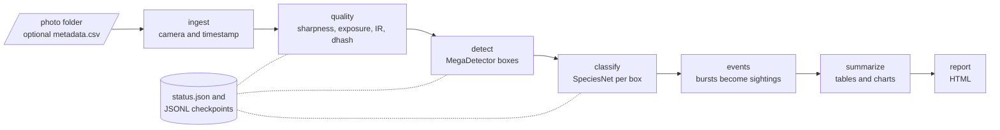
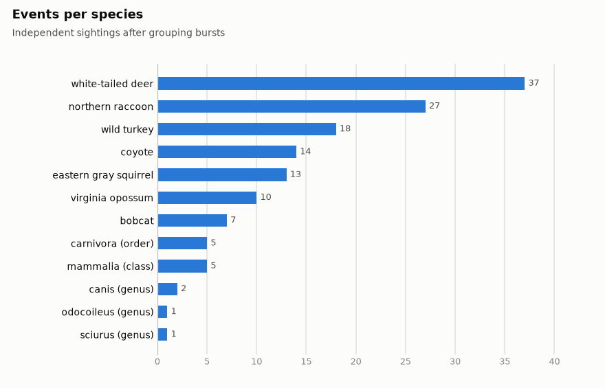
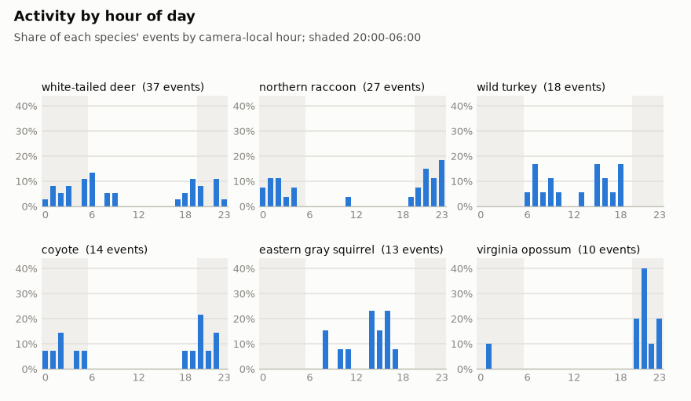
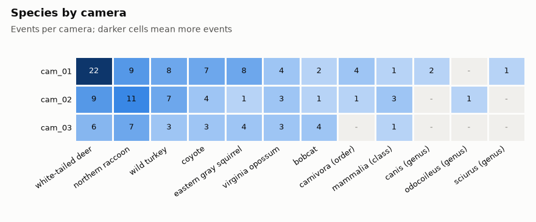
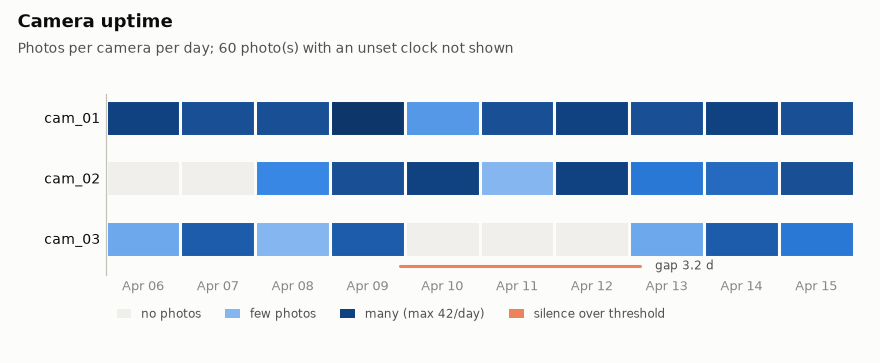

# camera_trap_pipeline

A resumable pipeline that turns folders of camera-trap photos into a clean, queryable dataset.

[](https://github.com/maxskrehbiel/camera_trap_pipeline/actions/workflows/ci.yml)  

## Overview

Trail cameras produce thousands of photos with messy metadata: bursts of near-identical frames, wind-triggered empties, night shots in infrared, clocks that reset to 2000-01-01 when the batteries die, uploads that arrive truncated, and cameras that go dark for days. This project reads a folder of such photos and produces a small set of Parquet tables (photos, detection boxes, species labels, events, per-camera health), summary charts and an HTML report. Animals, people and vehicles are found with [MegaDetector](https://github.com/agentmorris/MegaDetector), and each animal box is labeled with [SpeciesNet](https://github.com/google/cameratrapai); both are open models that download their weights at run time and use a GPU when one is available. Every stage checkpoints to disk, so an interrupted run picks up where it stopped.

## Architecture



| Stage | What it does |
| --- | --- |
| `ingest` | Lists the images, resolves each photo's camera and capture time, and flags unreadable files and unset clocks. |
| `quality` | Measures sharpness, brightness, contrast and an infrared (night) score, computes a perceptual hash, and groups near-duplicates within each camera. |
| `detect` | Finds animal, person and vehicle boxes with MegaDetector. |
| `classify` | Labels each counted animal box with SpeciesNet's top five species, rolling up the taxonomy when the model is unsure. |
| `events` | Groups each camera's bursts into sightings and counts animals per species. |
| `summarize` | Builds species totals, activity by hour, species by camera and camera health tables, plus PNG charts. |
| `report` | Writes one HTML page that ties the charts and tables together. |

## Quickstart

```bash
git clone https://github.com/maxskrehbiel/camera_trap_pipeline.git
cd camera_trap_pipeline
python -m venv .venv
source .venv/bin/activate          # Windows: .venv\Scripts\activate
pip install -e ".[dev]"
camera_trap_pipeline demo
```

The demo draws about 800 synthetic trail-camera photos (three cameras, ten days), runs every stage with stand-in models that read the synthetic ground truth, and writes the report, charts and summary tables to `demo_output/`. It then checks its own output against the ground truth, prints each check, and exits with code 1 if any fails. It needs no network access and no model weights. Add `--simulate-crash` to watch detection stop halfway and resume from its checkpoint.

The committed [`examples/`](examples/) folder is the output of `camera_trap_pipeline demo --out examples`; CI regenerates it and fails if any text file changes.

| | |
| --- | --- |
|  |  |
|  |  |

All numbers in `examples/` come from synthetic data.

## Usage

### Command line

```text
camera_trap_pipeline run INPUT --out OUT [options]    run or resume the pipeline
camera_trap_pipeline status OUT                       show which stages are done
camera_trap_pipeline demo [--out DIR] [--work DIR] [--days N] [--cameras N] [--simulate-crash]
camera_trap_pipeline synth OUT [--days N] [--cameras N] [--seed N]
camera_trap_pipeline fetch_sample OUT [--cameras N] [--per-camera N]
```

`python -m camera_trap_pipeline` works in place of `camera_trap_pipeline`. Logging goes to stderr: warnings only by default, `-v` for progress and `-vv` for debug detail (for example `camera_trap_pipeline -v run ...`).

Options for `run`:

| Option | Default | Meaning |
| --- | --- | --- |
| `--detector {megadetector,mock}` | `megadetector` | `mock` reads `ground_truth.json` from a synthetic folder |
| `--detector-model` | `MDV5A` | any model name MegaDetector's `load_detector` accepts, or a weights file |
| `--detect-threshold` | `0.1` | lowest box confidence kept in `detections.parquet` |
| `--classifier {speciesnet,mock,none}` | `speciesnet` | `none` leaves every animal as `animal (unresolved)` |
| `--classifier-model` | package default | SpeciesNet model name |
| `--device {auto,cpu,cuda}` | `auto` | where the models run |
| `--seed` | `7` | seed for the stand-in models |
| `--count-conf` | `0.2` | boxes at or above this confidence are counted and classified |
| `--species-threshold` | `0.65` | minimum score for a label before rolling up the taxonomy |
| `--event-gap` | `60` | seconds between photos that still belong to one event |
| `--gap-hours` | `48` | silence reported as a possible outage |
| `--valid-from` | `2001-01-01` | timestamps on or before this date are treated as an unset clock |
| `--strip-top`, `--strip-bottom` | `0` | fraction of the frame height to ignore (burned-in info bar) |
| `--workers` | `4` | threads for reading and decoding images |
| `--title` | `Camera-trap pipeline report` | report heading |
| `--redo STAGE` | | recompute a stage (repeatable, or `all`) |

Photos are expected one folder per camera (`INPUT/<camera>/.../*.jpg`). When cameras or times live elsewhere, put a `metadata.csv` in `INPUT` with the columns `file`, `camera_id` and `timestamp`; it overrides EXIF.

| Exit code | Meaning |
| --- | --- |
| `0` | Success |
| `1` | The demo's self-check against the synthetic ground truth failed |
| `2` | Usage, configuration or input error (bad argument, empty or missing input folder, malformed sidecar, failed download) |
| `3` | A required optional dependency is missing (`megadetector` or `speciesnet`; install with `pip install -e ".[models]"`) |

Errors print one line to stderr, with no traceback.

### Python API

This example runs offline: it draws a small synthetic dataset and uses the stand-in models.

```python
from pathlib import Path

import numpy as np
import pandas as pd

from camera_trap_pipeline.mock_models import MockClassifier, MockDetector
from camera_trap_pipeline.pipeline import Pipeline
from camera_trap_pipeline.settings import EventSettings, PipelineSettings, QualitySettings
from camera_trap_pipeline.synthetic import SyntheticSettings, generate_dataset, load_ground_truth

photos, run = Path("demo_output/api_photos"), Path("demo_output/api_run")
generate_dataset(photos, SyntheticSettings(n_cameras=2, n_days=3), np.random.default_rng(1))
truth = load_ground_truth(photos)

settings = PipelineSettings(
    events=EventSettings(gap_s=90),
    quality=QualitySettings(strip_bottom=0.07),  # ignore the synthetic info bar
)
Pipeline(
    photos,
    run,
    settings,
    detector_factory=lambda: MockDetector(truth, seed=1),
    classifier_factory=lambda: MockClassifier(truth, seed=1),
).run()

events = pd.read_parquet(run / "events.parquet")
print(events.groupby("observation_type")["n_photos"].agg(["count", "sum"]))
```

For real photos, pass `detector_factory=functools.partial(MegaDetector, "MDV5A")` from `camera_trap_pipeline.detect` and `classifier_factory=SpeciesNetClassifier` from `camera_trap_pipeline.classify`. Any object with a `name` attribute and a `detect(image, *, path)` method can stand in for the detector, and likewise `classify(image, boxes, *, path)` for the classifier.

## How it works

### Outputs

Everything lands in the output folder:

| File | One row per | Contents |
| --- | --- | --- |
| `media.parquet` | photo | path, camera, timestamp and where it came from, EXIF make and model |
| `quality.parquet` | photo | sharpness, brightness, contrast, IR score, dhash, flags, near-duplicate group |
| `detections.parquet` | box | category, confidence, normalized `x, y, w, h` |
| `classifications.parquet` | animal box | species call after roll-up, top-5 labels |
| `photos.parquet` | photo | everything above joined, plus counts and `event_id` |
| `events.parquet` | event | camera, start, end, photos, largest animal count, main species and its count |
| `event_species.parquet` | event and species | largest single-frame count of that species |
| `summary/*.parquet`, `summary/*.csv` | varies | the summary tables behind the report |
| `plots/*.png`, `report.html` | | charts and report |

### Ingest

Each image's camera comes from `metadata.csv` if present, else the first folder under the input, else the EXIF serial number or make and model. Its time comes from the sidecar, else EXIF `DateTimeOriginal`, else EXIF `DateTime`, and is kept as camera-local wall-clock time. A photo is flagged `timestamp_valid = False` when its time is on or before `--valid-from` (a reset clock) or more than a day in the future; such photos stay in the tables but are left out of events and activity summaries. Files whose headers cannot be read are kept and flagged. An input folder without any images is an error.

### Quality

Frames are shrunk to at most 640 px on the long side, after cropping any burned-in info bar, so numbers are comparable across cameras.

Sharpness is the variance of the Laplacian, a focus measure studied by Pech-Pacheco et al. (2000). For gray levels `I`, the Laplacian at a pixel is `L = I(x-1,y) + I(x+1,y) + I(x,y-1) + I(x,y+1) - 4 I(x,y)`, and sharpness is `Var(L)` over the frame. Blur from motion, fog or a dirty lens flattens edges and lowers it. A photo is flagged blurry when its sharpness is below 0.35 times the median of the same camera in the same day or night mode, because each scene's texture sets its own baseline. OpenCV computes the Laplacian when installed (`pip install -e ".[opencv]"`); the NumPy version uses the same kernel and border handling.

Brightness and contrast are the mean and standard deviation of the gray levels (0 to 255); below 30 is dark and above 225 is overexposed. The infrared score is `mean|R - G| + mean|G - B|`. Night frames lit by infrared are monochrome, so the score is near zero; below 4 the photo is flagged `is_ir`.

The difference hash (dhash, Krawetz 2013) shrinks the frame to 9 x 8 gray pixels and records, for each of the 64 neighbouring pairs in a row, whether brightness goes up or down. Two frames are near-duplicates when their hashes differ in at most 6 bits (Hamming distance) and the same camera took them within 5 minutes of each other. Each photo joins the group of the closest earlier match; the groups mark frames that add little new information.

### Detect and classify

MegaDetector returns boxes in normalized `[x_min, y_min, width, height]` with a confidence. All boxes at or above `--detect-threshold` are stored; only boxes at or above `--count-conf` are counted and sent to the classifier, up to 10 per photo. SpeciesNet's classifier runs on each box crop and returns its top five labels.

When the top score is below `--species-threshold`, scores are summed within each genus, then family, order and class, and the first group that reaches the threshold is used. For example, 0.40 white-tailed deer plus 0.35 mule deer becomes `odocoileus (genus)` at 0.75, instead of a wrong species or nothing.

### Events

Photos from one camera are sorted by time. A new event starts at the camera's first photo and whenever the gap to the previous photo is more than `--event-gap` seconds; gaps chain, so a long visit photographed every 30 s stays one event. An event's count for a species is the largest number of that species in any single frame, not the sum over frames, which would count one animal once per photo.

Labels are reconciled within each event before counting. A vaguer label folds into the one more specific label it contains, such as `cervidae (family)` into `white-tailed deer`. If labels still disagree in an event where no frame shows more than one animal, the frames show the same animal, and all labels are replaced by their closest common taxon.

### Summaries and camera health

Activity by hour counts events per species by the camera-local hour they started. A long silence is a gap between consecutive photos of one camera longer than `--gap-hours`; a trail camera fires only on motion, so a silence can be a quiet spell rather than an outage, but long ones are where dead batteries show up. Effort days are the days from the first to the last photo minus the long silences, and events per 100 effort days, for each species and camera, is the usual relative abundance index for comparing cameras that ran for different lengths of time.

### Resuming after a crash

`status.json` records each stage as started and then done. Finished stages are skipped on the next run, and an interrupted stage runs again. The quality, detect and classify stages append one JSON line per photo (or box) to `checkpoints/*.jsonl` and flush it straight away, so a rerun only processes what is missing. A line torn by a crash is dropped when the file is reopened. Photos that could not be decoded, or that a model reported it could not process, are recorded with the error and retried on the next run; any other exception stops the stage with its traceback, and everything processed so far stays in the checkpoint.

Models are loaded only when their stage has work to do, so resuming past detection does not load MegaDetector. Tables and the status file are written to a temporary file and renamed, so a crash never leaves half a file behind.

`--redo STAGE` deletes that stage's checkpoint and outputs and clears the flags of every later stage. Later stages reuse checkpoint entries whose inputs did not change: after `--redo detect`, boxes that come back identical keep their classifications, because the classification key includes the box coordinates. Photos added to the input after a run are reported on the next run; `--redo ingest` adds them, and only the new photos are measured, detected and classified.

### Demo self-check

The synthetic generator writes a `ground_truth.json` describing every visit and frame. After the demo run, `camera_trap_pipeline.grading` compares the tables with it: events map one-to-one onto visits and have the right type, animal counts are exact, at least 90% of species calls equal the true species or one of its ancestors, unset clocks, the truncated upload and infrared frames are all flagged, at least 80% of fogged frames are flagged blurry with at most 5% false alarms, at least 90% of repeated wind-triggered frames are grouped as near-duplicates with no group spanning two visits, and the planned outage is the only long silence.

## Project layout

```text
camera_trap_pipeline/
├── .github/workflows/ci.yml
├── examples/                  demo report, charts and summary CSVs (synthetic)
├── src/camera_trap_pipeline/
│   ├── __init__.py            package version
│   ├── __main__.py            python -m entry point
│   ├── _types.py              array aliases and checkpoint record types
│   ├── atomic_io.py           write-then-rename file output
│   ├── classify.py            classifier interface and SpeciesNet adapter
│   ├── cli.py                 subcommands, argument types and exit codes
│   ├── demo.py                end-to-end demo with self-check
│   ├── detect.py              detector interface and MegaDetector adapter
│   ├── errors.py              exceptions mapped to exit codes
│   ├── events.py              photo table, event grouping and counts
│   ├── grading.py             comparison of a run with the synthetic ground truth
│   ├── images.py              image loading and decode errors
│   ├── ingest.py              photo discovery, EXIF and sidecar metadata
│   ├── mock_models.py         stand-in detector and classifier
│   ├── parallel.py            ordered thread-pool map for image decoding
│   ├── pipeline.py            stage order, skipping and --redo
│   ├── plots.py               PNG charts
│   ├── public_sample.py       download of a small public dataset sample
│   ├── quality.py             sharpness, exposure, IR, dhash and near-duplicates
│   ├── report.py              HTML report
│   ├── settings.py            frozen settings dataclasses
│   ├── status.py              status.json flags and JSONL checkpoints
│   ├── summarize.py           summary tables and camera health
│   ├── synthetic.py           synthetic dataset writer and ground-truth reader
│   ├── synthetic_scene.py     drawing of synthetic frames
│   ├── synthetic_schedule.py  species behaviour, camera plans and visit timing
│   └── taxonomy.py            label parsing, roll-up and reconciliation
├── tests/                     unit and end-to-end tests; test_readme.py runs the Python API example
├── LICENSE
├── README.md
└── pyproject.toml
```

## Development

```bash
pip install -e ".[dev]"
ruff check .
ruff format --check .
mypy src
pytest --cov=camera_trap_pipeline --cov-report=term-missing
camera_trap_pipeline demo --out examples
git diff --exit-code -- examples/ ':(exclude)*.png'
```

The unit tests run offline: they generate synthetic photos with NumPy and Pillow, use the stand-in models, and fail if anything opens a network connection. Tests that need model weights or network access carry the `integration` marker, are deselected by default, and run with `pytest -m integration` after `pip install -e ".[models]"`.

## Data

### Synthetic data

Everything in this repository and in the test suite is generated by `camera_trap_pipeline.synthetic`: drawn backgrounds, animal silhouettes whose arrival times follow each species' daily activity curve, burned-in info bars and EXIF timestamps. The generator also injects the field problems the pipeline is meant to catch: one camera's clock is unset for the first days, one camera goes dark for several days, one camera's lens fogs one morning, wind triggers empty bursts, and one upload is truncated. The ground truth file records what was drawn, and both the tests and the demo's self-check compare the pipeline's events, counts and flags with it.

### Public camera-trap data

To try the real models on real photos, fetch a small sample of [Caltech Camera Traps](https://lila.science/datasets/caltech-camera-traps) from LILA BC:

```bash
pip install -e ".[models]"
camera_trap_pipeline fetch_sample data/cct_sample --cameras 3 --per-camera 60
camera_trap_pipeline run data/cct_sample --out runs/cct_sample
```

`fetch_sample` downloads the dataset's metadata once, picks whole image sequences from a few camera locations, saves the images under `data/cct_sample/location_<id>/`, writes the capture times and locations from the metadata to `metadata.csv`, and writes the license and citation to `attribution.txt`. `--metadata-url` and `--image-base-url` point it at any other dataset published in COCO Camera Traps format. Downloaded images stay local and are ignored by git. Caltech Camera Traps is released under the [Community Data License Agreement - Permissive 1.0](https://cdla.io/permissive-1-0/).

### Models

Weights are downloaded by the model packages on first use and are not part of this repository. MegaDetector comes from the [MegaDetector](https://github.com/agentmorris/MegaDetector) project under the MIT License, and SpeciesNet from [google/cameratrapai](https://github.com/google/cameratrapai) under the Apache License 2.0. The inference libraries these packages install carry their own licenses; check them before redistributing a bundled build.

## Limitations

- The model adapters target the public Python APIs of the `megadetector` and `speciesnet` packages. Unit tests cover them against stand-ins, and integration tests exercise the real packages, but continuous integration does not download weights.
- Only SpeciesNet's classifier is used, on each box. SpeciesNet's ensemble step, which also applies a geographic filter to exclude species that do not occur in a region, labels whole images and is not applied, so out-of-range species can appear in low-light photos.
- Timestamps are camera-local wall-clock times. Cameras set to different time zones, or clocks that drift, are not corrected; photos from reset clocks are flagged, not repaired.
- Events are defined per camera by a time gap. Two animals that pass one after the other within the gap become one event, and one animal seen by two cameras becomes two events.
- A long silence can mean an outage or simply no motion; the report shows both the same way.
- Near-duplicate flags describe redundancy and are not used to skip photos, because a small animal can change few hash bits.
- The synthetic photos exercise the data handling, not the models: stand-in detection and classification are generated from the ground truth with noise, so the demo numbers say nothing about model accuracy.

## References

- Beery, S., Morris, D., and Yang, S. (2019). Efficient Pipeline for Camera Trap Image Review. arXiv:1907.06772.
- Beery, S., Van Horn, G., and Perona, P. (2018). Recognition in Terra Incognita. European Conference on Computer Vision (ECCV). arXiv:1807.04975.
- Gadot, T., Istrate, Ș., Kim, H., Morris, D., Beery, S., Birch, T., and Ahumada, J. (2024). To crop or not to crop: Comparing whole-image and cropped classification on a large dataset of camera trap images. IET Computer Vision 18(8), 1193-1208. doi:10.1049/cvi2.12318.
- Krawetz, N. (2013). Kind of Like That. The Hacker Factor Blog, 21 January 2013.
- Pech-Pacheco, J. L., Cristóbal, G., Chamorro-Martínez, J., and Fernández-Valdivia, J. (2000). Diatom autofocusing in brightfield microscopy: a comparative study. Proceedings of the 15th International Conference on Pattern Recognition (ICPR), vol. 3. doi:10.1109/ICPR.2000.903548.

## License

MIT © Maxwell Krehbiel. See [LICENSE](LICENSE).
